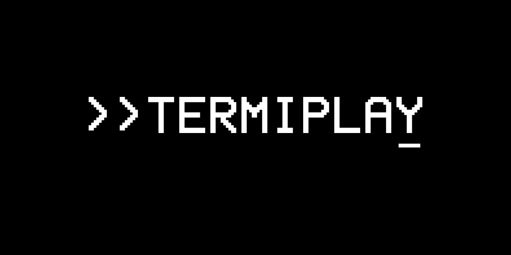

# Termiplay



A terminal media player written in C.


**Termiplay** uses braille characters and an assortment of dithering algorithms to present high-fidelity
video despite the constraints that come with being in a terminal.


## Installation

>[!NOTE]
> This is a Windows-only program, specifically for Windows Terminal.

### From Releases

Download and extract one of the releases at the [Releases](https://github.com/a22Dv/termiplay/releases) section of this repository. 


Make sure FFmpeg is installed and is in your system's PATH, along with
FFprobe. Download them at [FFmpeg](https://ffmpeg.org/)'s official website.


## Getting Started

Go to the path where you extracted the archive and run to start with.
```
./termiplay "<PATH TO MEDIA FILE>"
```

This player accepts a variety of media files, from .mp3s, .mp4s, and so on. if it is supported by FFmpeg, it's going to do just fine.

>[!NOTE]
> This player's behavior when it comes to multi-stream media files
> are undefined as it still hasn't been tested for those.

To control the player:

```
M - Mute
SPACE - Toggle playback.
L - Enable looping.
UP ARROW - Increase Volume.
DOWN ARROW - Decrease Volume.
RIGHT ARROW - Seek backward.
LEFT ARROW - Seek forward.
R - Switch through foreground colors.
D - Switch through dithering algorithms.
G - Toggle debug print.
Q - Quit
```

>[!WARNING]
> This player can be freely resized and it will accomodate accordingly.
> Do keep in mind that it has hard limits on how big each frame
> can be. Exceedingly large frame sizes beyond >1000x400 increases
> the chances of the player destabilizing. This is especially the case
> for Floyd-Steinberg as it is computationally expensive. Although
> the specific limit depends on your system's capabilities, this player
> still doesn't allow any frame larger than 1440p. As this is a hard
> limit set by the buffer size for each frame. This limit will almost never
> be reached in regular use-cases.

## Features

- Supports variable size, aspect ratio and frame-rate.
- Core media controls (e.g. seeking, looping, playback)
- Variable foreground 4-bit color on-the-fly.
- Supports a variety of dithering algorithms at runtime.
    - Floyd-Steinberg
    - Blue
    - Sierra-Lite (Modified)
    - Bayer 16x16
    - Bayer 8x8
    - Bayer 4x4
    - Halftone

## License

This project is licensed under the MIT license - see LICENSE for more details.

## Author

a22Dv - a22dev.gl@gmail.com
